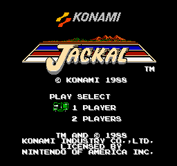

# Nez

NES emulator with Zig core and multiple UI frontends.

## Screenshots



```
├── lib/          Zig emulator core (CPU, PPU, APU, mappers)
├── flutter/      Flutter UI (macOS, Android)
├── avalonia/     Avalonia UI (macOS, Windows, Linux, Android)
├── roms/         ROM files (place .nes here)
├── build.sh      Build script
└── design.html   Interactive design mockup
```

## Quick Start

```bash
./build.sh flutter       # Flutter macOS
./build.sh avalonia       # Avalonia macOS
./build.sh apk            # Flutter Android APK
./build.sh apk-avalonia   # Avalonia Android APK
./build.sh lib            # Zig shared library only
./build.sh clean          # Clean all
```

## Prerequisites

| Frontend | Requirements |
|----------|-------------|
| All | [Zig](https://ziglang.org) 0.14+ |
| Flutter | [Flutter](https://flutter.dev) 3.x, Xcode (macOS) |
| Avalonia | [.NET](https://dotnet.microsoft.com) 10+ |
| Android | Android SDK + NDK |

## Architecture

```
┌─────────────────────────────────┐
│  UI (Flutter / Avalonia)        │
│  Library · Gameplay · Settings  │
├─────────────────────────────────┤
│  FFI Bridge (dart:ffi / P/Invoke)│
├─────────────────────────────────┤
│  Zig Emulator Core (C ABI)      │
│  CPU 6502 · PPU 2C02 · APU     │
│  Bus · Mappers (NROM/MMC1/UxROM)│
└─────────────────────────────────┘
```

The Zig core compiles to `libnez_emu.dylib` / `.so` / `.dll`, exposing C functions via `lib/src/ffi.zig`. Both Flutter and Avalonia call the same shared library.

## Controls

### Mobile
Virtual joystick + A/B + Turbo A/B buttons. Landscape mode: joystick left, game center, buttons right.

### Desktop

| Action | Key |
|--------|-----|
| Move | W A S D |
| A / B | J / K |
| Turbo A / B | U / I |
| Start / Select | Enter / X |
| Pause | Space |
| Record GIF | ⌘R |
| Debug | ⌘D |
| Back | Esc |

## Features

- **Web Remote Gamepad** — scan QR code to use phone as wireless controller (P1/P2)
  - Built-in HTTP server serves a touch gamepad page
  - Joystick + A/B/TA/TB diamond layout (Nintendo style)
  - MJPEG mirror mode: phone shows game display + controls
  - Auto fullscreen + landscape lock
  - Reset button
- **2-Player Support** — P2 controller via web gamepad (NES $4017)
- **GIF Recording** — capture gameplay to `~/.nes-zfa/recordings/`
- **Recordings Manager** — browse, copy, open folder, delete GIFs
- **ROM Library** — persistent library with bundled ROMs in APK
- **Window Fit** — one-click remove black bars on macOS
- **Audio** — macOS (AVAudioEngine) + Android (AudioTrack)
- **Virtual Gamepad** — touch joystick + turbo buttons (mobile)
- **Debug Panel** — CPU registers, PPU status (⌘D)
- **Adaptive Layout** — portrait/landscape on mobile, responsive desktop

## Emulator Roadmap

- [x] CPU: Ricoh 2A03 (cycle-accurate 6502)
- [x] PPU: Ricoh 2C02 (scanline renderer)
- [x] Vertical scrolling
- [x] Horizontal scrolling
- [x] Split scrolling
- [x] Sprite zero hit
- [x] Controller input
- [ ] APU: Full audio support (2/5 channels implemented)
- [ ] Sprite overflow detection
- **Mappers:**
  - [x] NROM (Mapper 0)
  - [x] MMC1 (Mapper 1) — some minor bugs remain
  - [x] UxROM (Mapper 2)
  - [ ] CNROM (Mapper 3)
  - [ ] MMC3 (Mapper 4)
  - [ ] MMC5 (Mapper 5)

## Supported Games

- **NROM** — Donkey Kong, Pac-Man, Super Mario Bros
- **MMC1** — Mega Man, Legend of Zelda
- **UxROM** — Contra, Castlevania, Jackal

## Credits

Emulator core based on [nez](https://github.com/) — a Zig NES emulator. Key improvements made in this fork:

- **PPU sprite rendering fixes** — 3 critical bugs in sprite evaluation at cycle 257:
  - Removed incorrect Y+1 offset in secondary OAM
  - Fixed scanline reference (current vs next)
  - Fixed 8x16 sprite pattern table selection (tile index `&= 0xFE`, bank from bit 0)
- **Player 2 controller** — Added second gamepad ($4017 read), shared strobe
- **FFI bridge** — Complete C ABI export layer (`lib/src/ffi.zig`) for Dart/Flutter and .NET/Avalonia integration
- **Web remote gamepad** — Built-in HTTP/WebSocket server, HTML5 touch controller with MJPEG mirror
- **Cross-platform audio** — macOS AVAudioEngine (Float32) + Android AudioTrack (PCM16)
- **GIF recording** — Frame capture + encoding pipeline for both frontends

UI frontends (Flutter + Avalonia) and all platform integrations by this project.

## License

MIT
